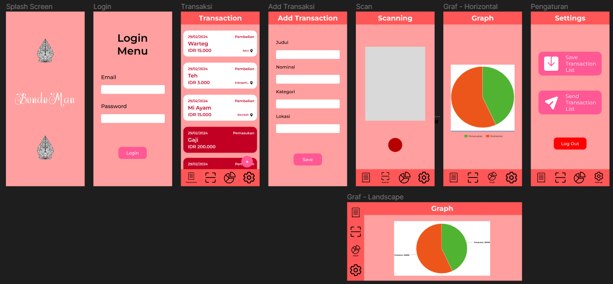

# IF3210-2024-Android-PDD

## Deskripsi
Bondoman merupakan aplikasi untuk menyediakan data terkait histori penjualan dan pembelian yang sudah pernah dilakukan sebelumnya. Aplikasi ini menyediakan histori terkait daftar penjualan dan pembelian, dapat melakukan scan untuk menambah daftar dengan kamera atau dari galeri, menampilkan histori transaksi dalam graf, dan juga melakukan pengiriman serta penyimpanan file terkait histori penjualan dan pembelian. Aplikasi ini sebdiri berbasis Android.

## External Libraries
- Retrofit
- Gson

## Screenshots

## Team Members
<table>
  <tr>
    <th>NIM</th>
    <th>Nama</th>
    <th>Tugas</th>
    <th>Waktu Dedikasi</th>
  </tr>
  <tr>
    <td>13521008</td>
    <td>Jason Rivalino</td>
    <td>
      - Tampilan layar 
      - Intent Gmail 
      - Broadcast
    </td>
    <td>25 jam</td>
  </tr>
  <tr>
    <td>13521028</td>
    <td>M. Zulfiansyah Bayu Pratama</td>
    <td>
      - Transaksi 
      - Graf
    </td>
    <td>30 jam</td>
  </tr>
  <tr>
    <td>13521029</td>
    <td>M. Malik I. Baharsyah</td>
    <td>
        - Scanner 
        - JWT Expired 
        - Network Sensing 
        - Login & Logout
    </td>
    <td>35 jam</td>
  </tr>
</table>